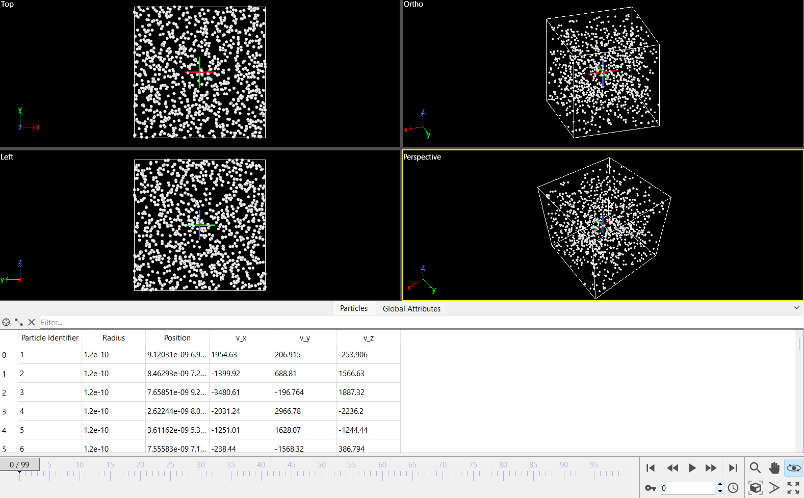
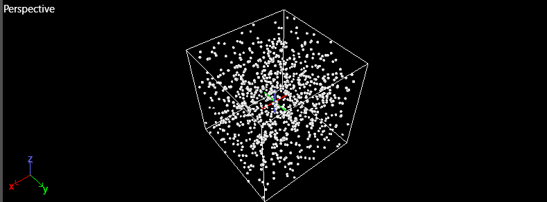
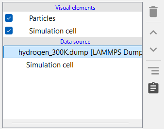
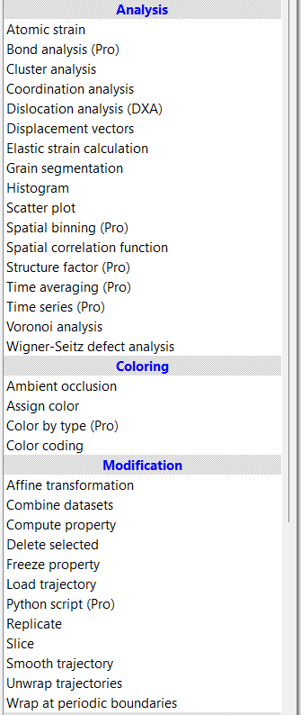

# LangevinMD

<div align="center">

[](https://www.python.org/downloads/)
[](LICENSE)
[](tests/)

A Python framework for molecular dynamics simulations using Langevin dynamics




</div>

---

## 📋 Table of Contents

- [Overview](#overview)
- [Features](#features)
- [Physics Background](#physics-background)
- [Installation](#installation)
- [Quick Start](#quick-start)
- [Usage](#usage)
- [Configuration](#configuration)
- [Visualization](#visualization)
- [Project Structure](#project-structure)
- [Examples](#examples)
- [Testing](#testing)
- [Contributing](#contributing)
- [License](#license)

---

## Overview

**LangevinMD** is a molecular dynamics simulation package that implements the Langevin equation of motion to simulate the behavior of molecular systems at finite temperatures. The package provides a flexible framework for studying gas-phase dynamics, thermalization, and statistical mechanics of particle systems.

### What is Langevin Dynamics?

Langevin dynamics is a stochastic simulation method that models the motion of particles in contact with a thermal bath (heat reservoir). It combines:
- **Deterministic forces** from particle interactions
- **Friction forces** that dissipate energy
- **Random forces** that maintain thermal equilibrium

This approach is particularly useful for:
- Studying equilibrium properties at constant temperature
- Modeling systems in contact with a heat bath
- Simulating gas-phase molecular dynamics
- Testing statistical mechanics principles

---

 Features

### Core Functionality
- **Langevin Thermostat**: Maintains constant temperature through friction and random forces
- **Flexible Boundary Conditions**: 
  - Reflective boundaries for gas simulations
  - Periodic boundaries for bulk systems
- **LAMMPS-Compatible Output**: Trajectory files in LAMMPS dump format for easy visualization
- **Real-Time Analysis**: Temperature monitoring and energy analysis
- **YAML Configuration**: Easy-to-use configuration files for complex simulations

### Physical Accuracy
- Proper implementation of the fluctuation-dissipation theorem
- Energy conservation validation
- Temperature control with configurable relaxation times
- SI unit system for clear physical interpretation
- Euler integration with customizable timesteps

### Developer-Friendly
- Modular architecture for easy extension
- Comprehensive test suite with pytest
- Built-in plotting and analysis tools
- Detailed documentation and examples
- Pure Python implementation with NumPy

---

## Physics Background

### The Langevin Equation

The motion of particles in a Langevin simulation follows:

$$m \frac{d\mathbf{v}}{dt} = -\gamma m \mathbf{v} + \mathbf{F}_{\text{random}}(t)$$

where:
- $m$ is the particle mass
- $\gamma = 1/\tau$ is the friction coefficient
- $\tau$ is the relaxation time
- $\mathbf{F}_{\text{random}}$ is a stochastic force

### Fluctuation-Dissipation Theorem

The random force satisfies:

$$\langle \mathbf{F}_{\text{random}}(t) \cdot \mathbf{F}_{\text{random}}(t') \rangle = 2m k_B T \gamma \delta(t-t')$$

This ensures that the system reaches thermal equilibrium at temperature $T$.

### Temperature Calculation

The instantaneous temperature is computed from the kinetic energy:

$$T = \frac{2 \langle E_{\text{kinetic}} \rangle}{3 N k_B}$$

where $N$ is the number of particles and $k_B$ is the Boltzmann constant.

---

## Installation

### Prerequisites

- Python 3.8 or higher
- pip package manager

### Install from Source

```bash
# Clone the repository
git clone https://github.com/anson10/langevinMD.git
cd langevinMD

# Install dependencies
pip install -r requirements.txt

# Install in development mode
pip install -e .
```

### Dependencies

```
numpy>=1.21.0      # Numerical computations
matplotlib>=3.5.0  # Plotting and visualization
pyyaml>=6.0        # Configuration file parsing
pytest>=7.0.0      # Testing framework
```

---

## Quick Start

Run your first simulation in 3 steps:

```python
from src.simulation import LangevinSimulation

# 1. Create a simulation
sim = LangevinSimulation(
    natoms=1000,              # Number of atoms
    mass=1.008e-3,            # Hydrogen mass (kg/mol)
    box=((0, 1e-8), (0, 1e-8), (0, 1e-8)),  # 10nm x 10nm x 10nm box
    temperature=300,          # 300 Kelvin
    dt=1e-15,                 # 1 femtosecond timestep
    relaxation_time=1e-12     # 1 picosecond relaxation
)

# 2. Run the simulation
results = sim.run(
    nsteps=10000,
    output_file='outputs/hydrogen_300K.dump',
    dump_frequency=100,
    verbose=True
)

# 3. Plot temperature evolution
sim.plot_temperature(filename='temperature.png')
```

**That's it!** Your trajectory is saved and ready for visualization.

---

## Usage

### Running from Configuration Files

The recommended way to run simulations:

```bash
python examples/hydrogen_gas.py examples/configs/hydrogen.yaml
```

### Configuration File Format

Create a YAML file with your simulation parameters:

```yaml
# System parameters
natoms: 1000
mass: 1.008e-3  # kg/mol (hydrogen)
radius: 120e-12  # meters

# Simulation box (meters)
box:
  - [0, 1.0e-8]  # x: 0 to 10 nm
  - [0, 1.0e-8]  # y: 0 to 10 nm
  - [0, 1.0e-8]  # z: 0 to 10 nm

# Thermodynamic parameters
temperature: 300  # Kelvin

# Integration parameters
dt: 1.0e-15  # seconds (1 femtosecond)
relaxation_time: 1.0e-12  # seconds (1 picosecond)
nsteps: 10000

# Boundary conditions
boundary_type: reflective  # or 'periodic'

# Output parameters
output_file: outputs/hydrogen_300K.dump
dump_frequency: 100
plot_temperature: true
```

### Command-Line Arguments

```bash
# Run with custom configuration
python examples/hydrogen_gas.py --config my_simulation.yaml

# Run with default parameters
python examples/hydrogen_gas.py --default

# Specify number of steps
python examples/hydrogen_gas.py --config hydrogen.yaml --nsteps 50000
```

---

## Visualization

### Using OVITO (Recommended)

[OVITO](https://www.ovito.org/) is a powerful visualization tool for molecular dynamics trajectories.

#### Loading Trajectory Files

1. **Open OVITO** and load your dump file:
   ```
   File → Load File → outputs/hydrogen_300K.dump
   ```

2. **Initial view** of the particle system:


*Placeholder: Add screenshot of initial particle configuration in OVITO*

#### Visualization Tips

**Particle Rendering:**
- Use "Particles" visual element
- Adjust particle radius for better visibility
- Color by velocity magnitude or particle ID


*Placeholder: Add screenshot showing particle rendering options*

**Time Evolution:**
- Use the animation controls to see particle motion
- Adjust playback speed for smoother visualization
- Export animations as video or image sequences


*Placeholder: Add screenshot or GIF of animated trajectory*

**Statistical Analysis:**
- Compute radial distribution function g(r)
- Analyze velocity distributions
- Monitor temperature fluctuations


*Placeholder: Add screenshot of analysis tools in OVITO*

### Built-in Plotting

Temperature evolution over time:

```python
sim.plot_temperature(
    filename='temperature_evolution.png',
    window_size=100,  # Moving average window
    show=True
)
```


*Placeholder: Add temperature vs time plot*

---

## 📁 Project Structure

```
langevinMD/
│
├── examples/                    # Example scripts and configurations
│   ├── hydrogen_gas.py         # Main example: hydrogen gas simulation
│   └── configs/
│       └── hydrogen.yaml       # Configuration file for hydrogen
│
├── src/                        # Source code
│   ├── simulation.py           # Main simulation class
│   ├── forces.py              # Force computation (Langevin)
│   ├── integrators.py         # Time integration methods
│   ├── boundary.py            # Boundary condition handlers
│   ├── constants.py           # Physical constants
│   ├── init.py               # System initialization
│   │
│   ├── io/                    # Input/Output modules
│   │   ├── config_loader.py   # YAML configuration parser
│   │   └── lammps_writer.py   # LAMMPS dump file writer
│   │
│   └── utils/                 # Utility functions
│       └── analysis.py        # Analysis tools (temperature, etc.)
│
├── tests/                      # Test suite
│   ├── test_forces.py         # Test force calculations
│   ├── test_integrators.py    # Test integration methods
│   └── test_boundary.py       # Test boundary conditions
│
├── outputs/                    # Output directory for trajectories
│   └── hydrogen_300K.dump     # Example output file
│
├── requirements.txt           # Python dependencies
├── setup.py                   # Package installation script
└── README.md                  # This file
```

---

## 💡 Examples

### Example 1: Hydrogen Gas at Room Temperature

Simulate 1000 hydrogen atoms in a 10nm cubic box at 300K:

```python
from src.simulation import LangevinSimulation

sim = LangevinSimulation(
    natoms=1000,
    mass=1.008e-3,  # H₂ molecular mass
    box=((0, 1e-8), (0, 1e-8), (0, 1e-8)),
    temperature=300,
    dt=1e-15,
    relaxation_time=1e-12,
    boundary_type='reflective'
)

results = sim.run(nsteps=10000, output_file='outputs/hydrogen_300K.dump')
```

### Example 2: High-Temperature Simulation

Study gas behavior at 1000K:

```python
sim = LangevinSimulation(
    natoms=500,
    mass=1.008e-3,
    box=((0, 2e-8), (0, 2e-8), (0, 2e-8)),  # Larger box
    temperature=1000,  # High temperature
    dt=5e-16,  # Smaller timestep for faster particles
    relaxation_time=5e-13
)

results = sim.run(nsteps=20000, output_file='outputs/hydrogen_1000K.dump')
```

### Example 3: Thermalization Study

Watch the system equilibrate from a cold start:

```python
# Start with low kinetic energy
sim = LangevinSimulation(
    natoms=1000,
    mass=1.008e-3,
    box=((0, 1e-8), (0, 1e-8), (0, 1e-8)),
    temperature=300,
    dt=1e-15,
    relaxation_time=1e-12
)

# Monitor temperature over time
results = sim.run(
    nsteps=50000,
    output_file='outputs/thermalization.dump',
    dump_frequency=50,
    verbose=True
)

# Plot to see equilibration
sim.plot_temperature(filename='thermalization.png')
```


*Placeholder: Add plot showing temperature reaching equilibrium*

---

## 🧪 Testing

Run the test suite to verify installation:

```bash
# Run all tests
pytest tests/

# Run with coverage report
pytest --cov=src tests/

# Run specific test file
pytest tests/test_forces.py -v

# Run with detailed output
pytest tests/ -v -s
```

### Test Coverage

- ✅ **Force calculations**: Langevin force, fluctuation-dissipation theorem
- ✅ **Integration**: Euler method, energy conservation
- ✅ **Boundary conditions**: Reflective and periodic boundaries
- ✅ **Temperature control**: Thermalization and equilibration
- ✅ **I/O operations**: Config loading, trajectory writing

---

## 🎯 Roadmap

### Current Features (v1.0)
- [x] Langevin thermostat implementation
- [x] Reflective and periodic boundaries
- [x] LAMMPS dump file output
- [x] Temperature monitoring
- [x] YAML configuration support

### Planned Features (v2.0)
- [ ] Lennard-Jones interactions
- [ ] Nose-Hoover thermostat
- [ ] Velocity Verlet integration
- [ ] Multi-species simulations
- [ ] Parallel processing support
- [ ] HDF5 output format
- [ ] Interactive Jupyter notebook examples
- [ ] GPU acceleration with CuPy

---

## 🤝 Contributing

Contributions are welcome! Here's how you can help:

1. **Fork the repository**
2. **Create a feature branch**: `git checkout -b feature/amazing-feature`
3. **Make your changes** and add tests
4. **Run tests**: `pytest tests/`
5. **Commit**: `git commit -m 'Add amazing feature'`
6. **Push**: `git push origin feature/amazing-feature`
7. **Open a Pull Request**

### Development Guidelines

- Follow PEP 8 style guidelines
- Add docstrings to all functions and classes
- Write unit tests for new features
- Update documentation as needed
- Use type hints where appropriate

---

## 📚 References

### Scientific Background

1. **Langevin, P.** (1908). "Sur la théorie du mouvement brownien". *C. R. Acad. Sci. Paris*, 146, 530-533.

2. **Kubo, R.** (1966). "The fluctuation-dissipation theorem". *Rep. Prog. Phys.*, 29(1), 255.

3. **Allen, M. P., & Tildesley, D. J.** (2017). *Computer Simulation of Liquids* (2nd ed.). Oxford University Press.

4. **Frenkel, D., & Smit, B.** (2001). *Understanding Molecular Simulation: From Algorithms to Applications* (2nd ed.). Academic Press.

### Software Tools

- **OVITO**: https://www.ovito.org/ - Visualization software for molecular dynamics
- **LAMMPS**: https://www.lammps.org/ - Large-scale molecular dynamics simulation package
- **NumPy**: https://numpy.org/ - Numerical computing library

---

## 📄 License

This project is licensed under the MIT License - see the [LICENSE](LICENSE) file for details.

---

## 👤 Author

**Anson Antony S**
- GitHub: [@anson10](https://github.com/anson10)
- Email: hello@ansonantony.tech

---

## 🙏 Acknowledgments

- Thanks to the molecular dynamics community for theoretical foundations
- OVITO developers for excellent visualization tools
- NumPy and SciPy communities for numerical computing infrastructure

---

<div align="center">

**⭐ Star this repository if you find it helpful! ⭐**

Made with ❤️ for the computational physics community

</div>
